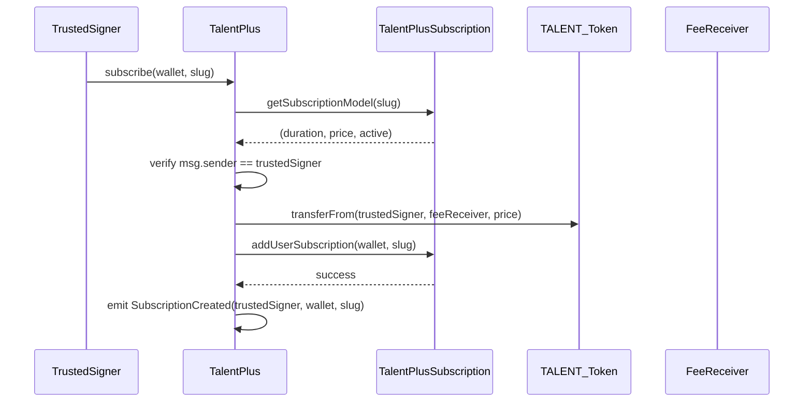
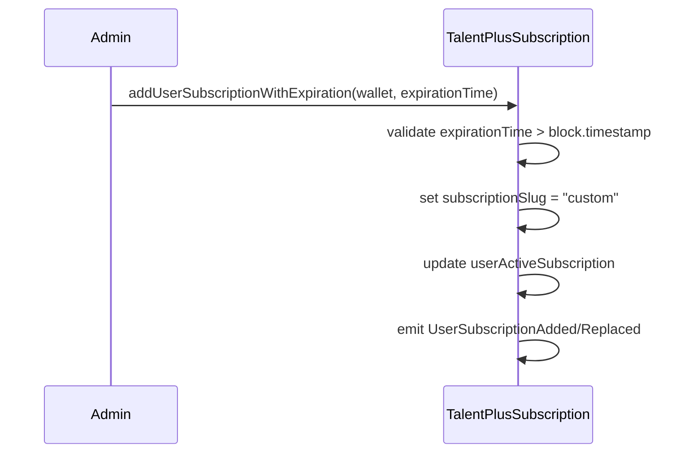

# TalentPlus Smart Contracts

This directory contains the core smart contracts for the TalentPlus subscription system, consisting of two main contracts that work together to provide a comprehensive subscription management solution.

## Overview

The TalentPlus system enables trusted signers to purchase subscriptions for users using TALENT tokens, with flexible subscription models and administrative capabilities for custom subscription management. Trusted signers can purchase subscriptions for any wallet address, enabling gift subscriptions and corporate subscription management.

## Contracts

### 1. TalentPlusSubscription.sol

The core subscription management contract that handles subscription models and user subscriptions.

#### Key Features

- **Subscription Model Management**: Create, update, and deactivate subscription models
- **User Subscription Management**: Add, upgrade, and extend user subscriptions
- **Custom Expiration Support**: Administrative function to set custom expiration times
- **Access Control**: Owner and trusted signer permissions
- **Subscription Queries**: Comprehensive view functions for subscription status

#### Main Functions

**Subscription Model Management:**
- `addSubscriptionModel(string subscriptionSlug, uint256 durationInSeconds, uint256 priceInTalent)`
- `updateSubscriptionModel(string subscriptionSlug, uint256 durationInSeconds, uint256 priceInTalent)`
- `deactivateSubscriptionModel(string subscriptionSlug)`

**User Subscription Management:**
- `addUserSubscription(address wallet, string subscriptionSlug)` - Standard subscription with model-based duration
- `addUserSubscriptionWithExpiration(address wallet, uint256 expirationTime)` - Custom expiration time (sets slug as "custom")

**Query Functions:**
- `hasActiveSubscription(address wallet)`
- `hasActiveSubscriptionForModel(address wallet, string subscriptionSlug)`
- `getCurrentActiveSubscription(address wallet)`
- `getSubscriptionExpiration(address wallet)`
- `getSubscriptionStartTime(address wallet)`

**Access Control:**
- `addTrustedSigner(address signer)`
- `removeTrustedSigner(address signer)`
- `isTrustedSigner(address signer)`

#### Data Structures

```solidity
struct SubscriptionModel {
    string subscriptionSlug;
    uint256 durationInSeconds;
    uint256 priceInTalent;
    bool active;
}

struct UserActiveSubscription {
    string subscriptionSlug;
    uint256 expirationTime;
    uint256 startTime;
}
```

### 2. TalentPlus.sol

The payment and subscription creation contract that handles TALENT token payments and integrates with TalentPlusSubscription. Only trusted signers can call the subscription functions.

#### Key Features

- **TALENT Token Integration**: Handles ERC20 token payments for subscriptions
- **Direct Access Control**: Only trusted signers can create subscriptions
- **Dynamic Pricing**: Fetches subscription costs from TalentPlusSubscription contract
- **Gift Subscriptions**: Trusted signers can purchase subscriptions for any wallet address
- **Administrative Control**: Owner-managed contract settings
- **Integration**: Seamless integration with TalentPlusSubscription

#### Main Functions

**Core Subscription:**
- `subscribe(address wallet, string subscriptionSlug)` - Main subscription function (trusted signers can purchase for any wallet)

**Administrative:**
- `setEnabled(bool _enabled)` - Enable/disable contract
- `setDisabled()` - Disable contract
- `updateReceiver(address _feeReceiver)` - Update fee receiver address
- `updateTalentPlusSubscription(address _talentPlusSubscriptionAddress)` - Update subscription contract address

#### Events

```solidity
event SubscriptionCreated(address indexed payer, address indexed recipient, string subscriptionSlug);
```

## Integration Flow

### 1. Subscription Purchase Flow



### 2. Custom Subscription Flow



## Key Integration Points

### 1. Trusted Signer Relationship

- **TalentPlus** contract must be added as a trusted signer in **TalentPlusSubscription**
- Only addresses designated as trusted signers can call `subscribe()` function
- Trusted signers pay for subscriptions and can purchase them for any wallet address
- This enables gift subscriptions and corporate subscription management

### 2. Dynamic Pricing

- TalentPlus fetches subscription prices dynamically from TalentPlusSubscription
- No hardcoded prices in TalentPlus contract
- Prices can be updated in TalentPlusSubscription without redeploying TalentPlus

### 3. Subscription Model Validation

- TalentPlus validates that subscription models are active before processing
- Inactive models are rejected at the payment level
- Model management is centralized in TalentPlusSubscription

## Usage Examples

### Basic Subscription Purchase

```solidity
// Trusted signer purchases subscription for a user
talentPlus.subscribe(userWallet, "premium");

// Trusted signer purchases subscription as a gift for another user
talentPlus.subscribe(recipientWallet, "premium");
```

### Custom Subscription Creation (Admin)

```solidity
// Admin creates custom subscription with specific expiration
talentPlusSubscription.addUserSubscriptionWithExpiration(
    userWallet, 
    1735689600 // Custom expiration timestamp
);
```

### Subscription Model Management

```solidity
// Add new subscription model
talentPlusSubscription.addSubscriptionModel(
    "enterprise",
    365 * 24 * 60 * 60, // 1 year
    ethers.utils.parseEther("500") // 500 TALENT
);
```

## Security Features

### 1. Access Control
- **Owner**: Can manage contract settings and trusted signers
- **Trusted Signers**: Can create subscriptions for any wallet address (pay for subscriptions)
- **Regular Users**: Cannot directly call subscription functions

### 2. Direct Access Control
- All subscriptions require the trusted signer to call the function directly
- Simple `msg.sender == trustedSigner` check instead of complex signature verification
- Prevents unauthorized subscription creation
- More gas-efficient than cryptographic signature verification

### 3. Reentrancy Protection
- Both contracts inherit `ReentrancyGuard`
- Prevents reentrancy attacks on critical functions

### 4. Input Validation
- Comprehensive validation of all inputs
- Address validation for wallet parameters
- Time validation for expiration timestamps

## Events

### TalentPlusSubscription Events

```solidity
event SubscriptionModelAdded(string indexed subscriptionSlug, uint256 durationInSeconds, uint256 priceInTalent);
event SubscriptionModelUpdated(string indexed subscriptionSlug, uint256 durationInSeconds, uint256 priceInTalent);
event SubscriptionModelDeactivated(string indexed subscriptionSlug);
event UserSubscriptionAdded(address indexed wallet, string indexed subscriptionSlug, uint256 expirationTime, uint256 startTime);
event UserSubscriptionReplaced(address indexed wallet, string indexed oldSlug, string indexed newSlug, uint256 expirationTime, uint256 startTime);
event UserSubscriptionExtended(address indexed wallet, string indexed subscriptionSlug, uint256 expirationTime, uint256 startTime);
event TrustedSignerAdded(address indexed signer);
event TrustedSignerRemoved(address indexed signer);
```

### TalentPlus Events

```solidity
event SubscriptionCreated(address indexed user, string subscriptionSlug);
```

## Deployment

See `scripts/talent_plus/deployTalentPlus.ts` for deployment instructions and `scripts/talent_plus/README.md` for additional script documentation.

## Testing

Comprehensive test suites are available in:
- `test/contracts/talent_plus/TalentPlus.ts`
- `test/contracts/talent_plus/TalentPlusSubscription.ts`

Run tests with:
```bash
npx hardhat test test/contracts/talent_plus/
```

## Architecture Benefits

### Simplified Design
- **Direct Access Control**: Uses simple `msg.sender` checks instead of complex signature verification
- **Gas Efficient**: Removes expensive cryptographic operations
- **Easy to Understand**: Straightforward logic - only trusted signers can create subscriptions
- **Maintainable**: Less complex code means fewer potential bugs and easier maintenance

### Use Cases
- **Gift Subscriptions**: Trusted signers can purchase subscriptions for any wallet
- **Corporate Subscriptions**: Companies can manage subscriptions for their employees
- **Promotional Subscriptions**: Marketing teams can give away subscriptions
- **Admin-Managed Subscriptions**: Administrators can create subscriptions for users

## Dependencies

- **OpenZeppelin Contracts**: `Ownable`, `ReentrancyGuard`, `IERC20`, `SafeERC20`
- **Solidity**: `^0.8.24`

## Network Configuration

The contracts support both mainnet and testnet deployments with network-specific configurations for:
- TALENT token addresses
- Fee receiver addresses
- Trusted signer addresses
