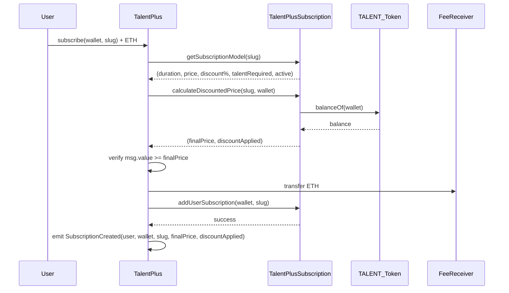
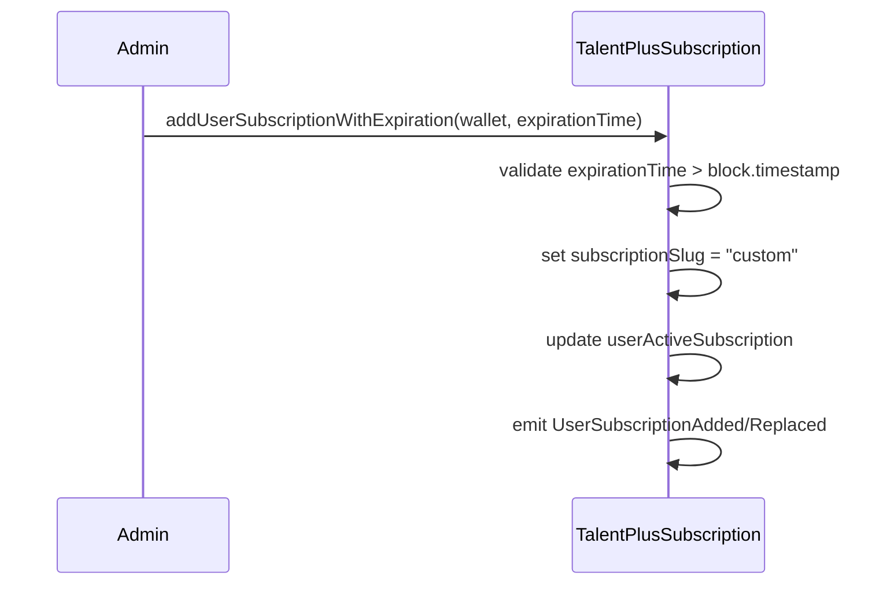

# TalentPlus Smart Contracts

This directory contains the core smart contracts for the TalentPlus subscription system, consisting of two main contracts that work together to provide a comprehensive subscription management solution.

## Overview

The TalentPlus system enables anyone to purchase subscriptions for users using ETH payments, with flexible subscription models, TALENT token-based discounts (including vault staking), and administrative capabilities for custom subscription management. Users can purchase subscriptions for any wallet address, enabling gift subscriptions and corporate subscription management.

## Contracts

### 1. TalentPlusSubscription.sol

The core subscription management contract that handles subscription models and user subscriptions.

#### Key Features

- **Subscription Model Management**: Create, update, and deactivate subscription models
- **TALENT Token Integration**: Check TALENT token balances and vault staking for discount eligibility
- **Dynamic Discount System**: Apply discounts based on combined TALENT holdings (balance + vault staking)
- **User Subscription Management**: Add, upgrade, and extend user subscriptions
- **Custom Expiration Support**: Administrative function to set custom expiration times
- **Access Control**: Owner and trusted signer permissions
- **Subscription Queries**: Comprehensive view functions for subscription status

#### Main Functions

**Subscription Model Management:**
- `addSubscriptionModel(string subscriptionSlug, uint256 durationInSeconds, uint256 priceInEth, uint256 discountPercentage, uint256 talentRequiredForDiscount)`
- `updateSubscriptionModel(string subscriptionSlug, uint256 durationInSeconds, uint256 priceInEth, uint256 discountPercentage, uint256 talentRequiredForDiscount)`
- `deactivateSubscriptionModel(string subscriptionSlug)`

**User Subscription Management:**
- `addUserSubscription(address wallet, string subscriptionSlug, address payer, uint256 pricePaid)` - Standard subscription with model-based duration. `payer` is who paid, `pricePaid` is the ETH amount paid.
- `addUserSubscriptionWithExpiration(address wallet, uint256 expirationTime)` - Custom expiration time (sets slug as "custom"). For these admin-set subscriptions, `payer` is `msg.sender` and `pricePaid` is `0` in the emitted events.

**Query Functions:**
- `hasActiveSubscription(address wallet)`
- `hasActiveSubscriptionForModel(address wallet, string subscriptionSlug)`
- `getCurrentActiveSubscription(address wallet)`
- `getSubscriptionExpiration(address wallet)`
- `getSubscriptionStartTime(address wallet)`
- `getSubscriptionModel(string subscriptionSlug)` - Returns model details including discount info
- `calculateDiscountedPrice(string subscriptionSlug, address wallet)` - Calculates final price with discount applied based on TALENT balance + vault staking

**Access Control:**
- `addTrustedSigner(address signer)`
- `removeTrustedSigner(address signer)`
- `isTrustedSigner(address signer)`

#### Data Structures

```solidity
struct SubscriptionModel {
    string subscriptionSlug;
    uint256 durationInSeconds;
    uint256 priceInTalent;
    bool active;
}

struct UserActiveSubscription {
    string subscriptionSlug;
    uint256 expirationTime;
    uint256 startTime;
}
```

### 2. TalentPlus.sol

The payment and subscription creation contract that handles ETH payments and integrates with TalentPlusSubscription. Anyone can call the subscription functions.

#### Key Features

- **ETH Payment Integration**: Handles native ETH payments for subscriptions
- **TALENT-Based Discounts**: Automatically applies discounts based on TALENT token holdings and vault staking
- **Direct Access**: Anyone can create subscriptions by calling the subscribe function
- **Dynamic Pricing**: Fetches subscription costs and applies discounts from TalentPlusSubscription contract
- **Gift Subscriptions**: Anyone can purchase subscriptions for any wallet address
- **Administrative Control**: Owner-managed contract settings
- **Integration**: Seamless integration with TalentPlusSubscription

#### Main Functions

**Core Subscription:**
- `subscribe(address wallet, string subscriptionSlug)` - Main subscription function (anyone can purchase for any wallet, requires ETH payment)

**Administrative:**
- `setEnabled(bool _enabled)` - Enable/disable contract
- `setDisabled()` - Disable contract
- `updateReceiver(address _feeReceiver)` - Update ETH fee receiver address
- `updateTalentPlusSubscription(address _talentPlusSubscriptionAddress)` - Update subscription contract address

#### Events

```solidity
event SubscriptionCreated(address indexed payer, address indexed recipient, string subscriptionSlug, uint256 finalPrice, bool discountApplied);
```

TalentPlusSubscription also emits enriched subscription events capturing the payer and amount paid:

```solidity
event UserSubscriptionAdded(address indexed wallet, string indexed subscriptionSlug, uint256 expirationTime, uint256 startTime, address payer, uint256 pricePaid);
event UserSubscriptionReplaced(address indexed wallet, string indexed oldSlug, string indexed newSlug, uint256 expirationTime, uint256 startTime, address payer, uint256 pricePaid);
event UserSubscriptionExtended(address indexed wallet, string indexed subscriptionSlug, uint256 expirationTime, uint256 startTime, address payer, uint256 pricePaid);
```

Notes:
- For purchases through `TalentPlus.subscribe`, `payer` is the caller and `pricePaid` is the final ETH price after any discount.
- For `addUserSubscriptionWithExpiration`, `payer = msg.sender` and `pricePaid = 0`.

## Integration Flow

### 1. Subscription Purchase Flow



### 2. Custom Subscription Flow



## Key Integration Points

### 1. Trusted Signer Relationship

- **TalentPlus** contract must be added as a trusted signer in **TalentPlusSubscription**
- Anyone can call `subscribe()` function to purchase subscriptions
- Users pay for subscriptions and can purchase them for any wallet address
- This enables gift subscriptions and corporate subscription management

### 2. Dynamic Pricing

- TalentPlus fetches subscription prices dynamically from TalentPlusSubscription
- No hardcoded prices in TalentPlus contract
- Prices can be updated in TalentPlusSubscription without redeploying TalentPlus

### 3. Subscription Model Validation

- TalentPlus validates that subscription models are active before processing
- Inactive models are rejected at the payment level
- Model management is centralized in TalentPlusSubscription

## Usage Examples

### Basic Subscription Purchase

```solidity
// User purchases subscription for themselves (full price)
talentPlus.subscribe(userWallet, "premium", { value: parseEther("100") });

// User purchases subscription as a gift for another user (with discount)
// Recipient has 5000 TALENT tokens, so gets 20% discount on premium subscription
talentPlus.subscribe(recipientWallet, "premium", { value: parseEther("80") }); // 100 - 20% = 80 ETH
```

### Discount System Management (Admin)

```solidity
// Admin creates subscription model with discount
talentPlusSubscription.addSubscriptionModel(
    "premium",           // subscription slug
    90 * 24 * 60 * 60,   // 90 days duration
    parseEther("100"),   // 100 ETH base price
    20,                  // 20% discount
    parseEther("5000")   // 5000 TALENT tokens required for discount
);

// Admin updates discount parameters
talentPlusSubscription.updateSubscriptionModel(
    "premium",
    90 * 24 * 60 * 60,
    parseEther("100"),
    25,                  // Updated to 25% discount
    parseEther("10000")  // Updated to 10000 TALENT tokens required
);

// Check discounted price for a specific wallet
(uint256 finalPrice, bool discountApplied) = talentPlusSubscription.calculateDiscountedPrice("premium", userWallet);
```

### Custom Subscription Creation (Admin)

```solidity
// Admin creates custom subscription with specific expiration
talentPlusSubscription.addUserSubscriptionWithExpiration(
    userWallet, 
    1735689600 // Custom expiration timestamp
);
```

### Subscription Model Management

```solidity
// Add new subscription model
talentPlusSubscription.addSubscriptionModel(
    "enterprise",
    365 * 24 * 60 * 60, // 1 year
    ethers.utils.parseEther("500") // 500 TALENT
);
```

## Security Features

### 1. Access Control
- **Owner**: Can manage contract settings and trusted signers
- **Anyone**: Can create subscriptions for any wallet address (pay for subscriptions)
- **Regular Users**: Can directly call subscription functions

### 2. Direct Access Control
- All subscriptions can be created by anyone calling the function directly
- Simple public function access instead of complex signature verification
- Prevents unauthorized subscription creation
- More gas-efficient than cryptographic signature verification

### 3. Reentrancy Protection
- Both contracts inherit `ReentrancyGuard`
- Prevents reentrancy attacks on critical functions

### 4. Input Validation
- Comprehensive validation of all inputs
- Address validation for wallet parameters
- Time validation for expiration timestamps

## Events

### TalentPlusSubscription Events

```solidity
event SubscriptionModelAdded(string indexed subscriptionSlug, uint256 durationInSeconds, uint256 priceInTalent);
event SubscriptionModelUpdated(string indexed subscriptionSlug, uint256 durationInSeconds, uint256 priceInTalent);
event SubscriptionModelDeactivated(string indexed subscriptionSlug);
event UserSubscriptionAdded(address indexed wallet, string indexed subscriptionSlug, uint256 expirationTime, uint256 startTime);
event UserSubscriptionReplaced(address indexed wallet, string indexed oldSlug, string indexed newSlug, uint256 expirationTime, uint256 startTime);
event UserSubscriptionExtended(address indexed wallet, string indexed subscriptionSlug, uint256 expirationTime, uint256 startTime);
event TrustedSignerAdded(address indexed signer);
event TrustedSignerRemoved(address indexed signer);
```

### TalentPlus Events

```solidity
event SubscriptionCreated(address indexed user, string subscriptionSlug);
```

## Deployment

See `scripts/talent_plus/deployTalentPlus.ts` for deployment instructions and `scripts/talent_plus/README.md` for additional script documentation.

## Testing

Comprehensive test suites are available in:
- `test/contracts/talent_plus/TalentPlus.ts`
- `test/contracts/talent_plus/TalentPlusSubscription.ts`

Run tests with:
```bash
npx hardhat test test/contracts/talent_plus/
```

## Architecture Benefits

### Simplified Design
- **Direct Access**: Uses simple public function calls instead of complex signature verification
- **Gas Efficient**: Removes expensive cryptographic operations
- **Easy to Understand**: Straightforward logic - anyone can create subscriptions
- **Maintainable**: Less complex code means fewer potential bugs and easier maintenance

### Use Cases
- **Gift Subscriptions**: Anyone can purchase subscriptions for any wallet
- **Corporate Subscriptions**: Companies can manage subscriptions for their employees
- **Promotional Subscriptions**: Marketing teams can give away subscriptions
- **Admin-Managed Subscriptions**: Administrators can create subscriptions for users
- **TALENT Holder Rewards**: Users with TALENT tokens or vault staking get automatic discounts
- **Tiered Pricing**: Different discount levels based on combined TALENT holdings (balance + vault staking)

### Discount System Benefits
- **Automatic Discounts**: No manual intervention required - discounts applied automatically
- **TALENT Token Utility**: Increases value and utility of TALENT tokens and vault staking
- **Flexible Configuration**: Admins can adjust discount percentages and requirements
- **Transparent Pricing**: Users can check their discounted price before purchasing
- **Fair Access**: Discounts based on actual token holdings and vault staking, not arbitrary criteria

## Vault Integration

The TalentPlus system integrates with the Talent Vault contract to provide enhanced discount eligibility based on staked TALENT tokens.

### Vault Address
- **Mainnet**: `0x23Ff3256A29847d7EF760943bd6679b565CbdE5a`
- **Testnet**: `0x23Ff3256A29847d7EF760943bd6679b565CbdE5a` (same address)

### How Vault Staking Works
1. **Combined Holdings**: Discount eligibility is calculated using `TALENT balance + vault staked amount`
2. **Automatic Detection**: The system automatically checks both wallet balance and vault staking
3. **Seamless Integration**: Users don't need to do anything special - staking automatically qualifies them for discounts
4. **Flexible Requirements**: Admins can set discount thresholds that consider both sources of TALENT holdings

### Example Scenarios
- **Scenario 1**: User has 500 TALENT in wallet + 500 TALENT staked in vault = 1000 TALENT total → qualifies for discount
- **Scenario 2**: User has 0 TALENT in wallet + 1000 TALENT staked in vault = 1000 TALENT total → qualifies for discount  
- **Scenario 3**: User has 1000 TALENT in wallet + 0 TALENT staked in vault = 1000 TALENT total → qualifies for discount

## Dependencies

- **OpenZeppelin Contracts**: `Ownable`, `ReentrancyGuard`, `IERC20`
- **Solidity**: `^0.8.24`

## Network Configuration

The contracts support both mainnet and testnet deployments with network-specific configurations for:
- TALENT token addresses
- Vault contract addresses
- Fee receiver addresses
